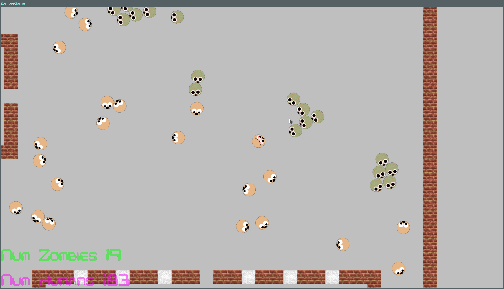
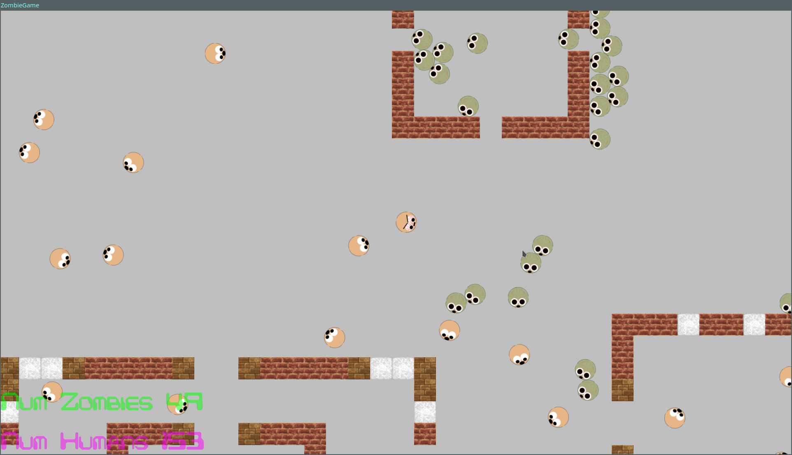

# Zombie Game

- There are two types of agents: Humans and Zombies
- Zombies chase humans, humans run from zombies.
- If a zombie catches a human, that human becomes a zombie.
- The player wins when all zombies are dead.
- The score is the number of humans still alive.
- Player has 3 weapons (swithc between them with the numbers `1-3`):
  - 1: Pistol
  - 2: Shotgun
  - 3: SMG

## Screenshots:

